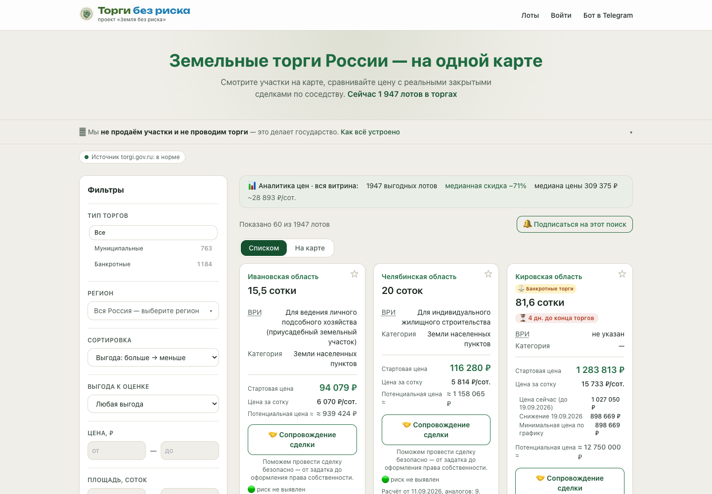

# Торги без риска

Сервис для поиска земельных участков на торгах и первичной оценки их рыночного контекста. На карте и в ленте собраны активные лоты с фильтрами по региону, площади, виду разрешённого использования и цене.

## Для кого

Инвесторам, покупателям и профессиональным участникам земельного рынка, которым важно быстрее находить интересные лоты и понимать, какие из них требуют детальной проверки.

## Что умеет

- собирает земельные лоты из торговых источников;
- показывает стартовую цену, параметры участка и ориентир рынка;
- помогает отфильтровать лоты по региону, площади, цене и ВРИ;
- позволяет заказать экспертный отчёт по конкретному участку;
- доставляет готовый PDF-отчёт в личный кабинет и Telegram.

Экспертный отчёт использует оценочный контур «Земля без риска check»: аналоги, ограничения, инфраструктура, коммуникации и другие факторы участка. Оценка помогает принять решение о дальнейшей проверке, но не является гарантией цены или результата торгов.

## Как работает

Пайплайн собирает и нормализует данные активных торгов, формирует карточки и предварительный рыночный ориентир. Пользователь выбирает лот, авторизуется и при необходимости заказывает углублённый отчёт. Заявку на участие в торгах пользователь подаёт самостоятельно у организатора — сервис не покупает и не бронирует лоты.

## Ссылки

- Сайт: [lots.zbrcheck.ru](https://lots.zbrcheck.ru)
- Telegram-бот: [@TorgiBezRiska_bot](https://t.me/TorgiBezRiska_bot)
- Родительский сервис оценки: [Земля без риска check](https://zbrcheck.ru)

## Статус исходного кода

Это публичная карточка продукта CodoCeh. Исходный код, конфигурация, ключи интеграций, пользовательские данные и рабочие сборки здесь не публикуются.
